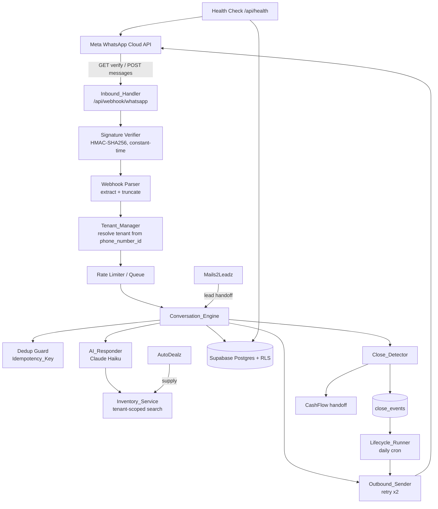
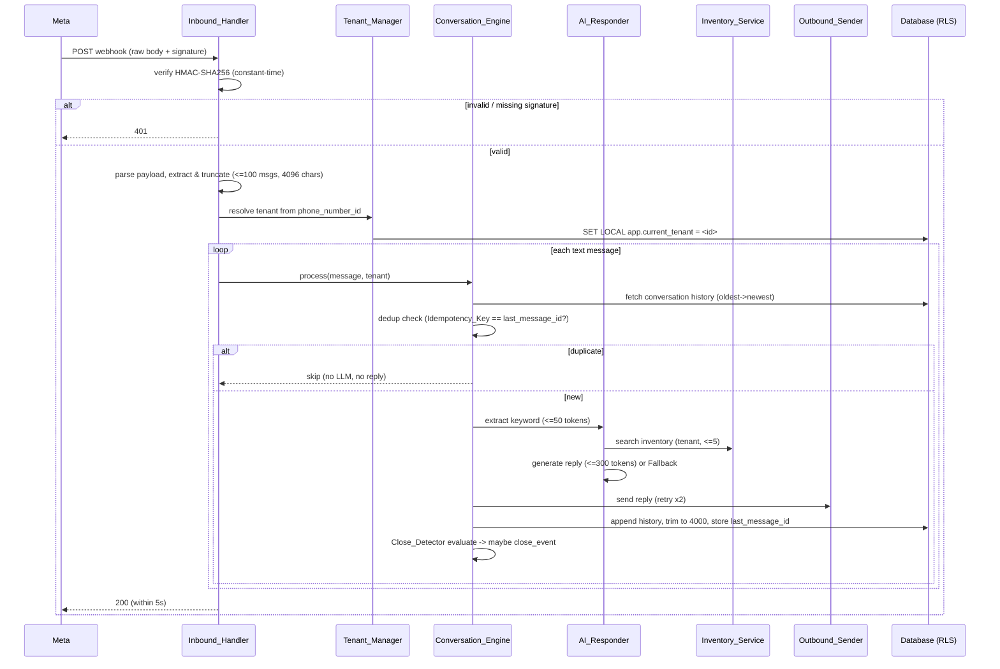

# Design Document

## Overview

RespondLeadz is the sales and conversion component of the SME operations stack. It receives inbound
WhatsApp messages, grounds AI responses in live per-tenant inventory, maintains conversation memory,
detects closed deals, and runs a post-close follow-up lifecycle. It is multi-tenant and interoperates
with sibling systems (CashFlow, AutoDealz, Mails2Leadz).

This design is a **consolidation and enhancement** of an existing codebase, not a greenfield build.
The repository today contains several competing implementations of the same pipeline. This document
selects a single canonical implementation, defines how the competing variants are retired, and
specifies the multi-tenant, cost-controlled, observable pipeline required by the requirements.

### Consolidation Decision (Requirement 11)

The workspace was surveyed before designing. The relevant existing assets are:

| Asset | Location | Disposition |
| --- | --- | --- |
| Native Next.js webhook (Claude) | `respond-leads/lib/whatsapp-webhook.ts` re-exported by `app/api/webhook/whatsapp/route.ts` | **Canonical base** — extend it |
| Claude AI service | `respond-leads/lib/claude-blueprint.ts` | **Canonical** — keep, refactor |
| WhatsApp transport | `respond-leads/lib/whatsapp.ts` | **Canonical** — keep, refactor |
| v9 route + service | `app/api/webhook/whatsapp/v9-route.ts`, `lib/whatsapp-v9.ts`, `lib/claude-v9.ts` | **Remove** |
| v10 route | `app/api/webhook/whatsapp/v10-route.ts` | **Remove** |
| Blueprint route + service | `app/api/webhook/whatsapp/blueprint-route.ts`, `lib/whatsapp-blueprint.ts` | **Remove** |
| Make.com blueprints (v9, v10, v11, post-close) | `*.blueprint.json`, `v9-clean-blueprint.json`, `whatsapp-ai-inventory-v10.json` | **Archive as `/reference` non-production material** |
| OpenAI agentic path | `respond-ai/` (entire app) | **Archive** — reference only; not deployed |
| Python RAG / Discord path | `respond-leads/python/` | **Archive as `/reference`** — not part of the production pipeline |

**Why the Claude/Next.js path is canonical:** It already satisfies the token caps required by
Requirement 14.2 (50 tokens for intent extraction, 300 for generation), enforces plain-text WhatsApp
formatting, grounds replies strictly in returned inventory, and implements `last_message_id`
deduplication. The OpenAI path uses `gpt-4o` with a 500-token cap and agentic multi-call loops, which
is more expensive and conflicts with the cost-control requirements. The Python RAG path introduces an
embedding pipeline and a Discord client that are out of scope for the WhatsApp sales pipeline.

**Canonical LLM provider (Requirement 11.4):** Anthropic Claude Haiku, configured through a single
provider abstraction. The provider is selected by configuration so a tenant cannot silently mix
providers, and the OpenAI path is not wired into production.

**Single production endpoint (Requirement 11.2):** Exactly one route, `POST/GET /api/webhook/whatsapp`,
handles inbound WhatsApp traffic. All `*-route.ts` variants are deleted so no second code path exists.

### Goals

- One canonical, maintainable pipeline replacing all competing versions.
- Strict per-tenant data isolation enforced at the database layer (RLS).
- Cost-controlled, responsive request handling within Vercel Hobby limits.
- Reliable inbound acknowledgement, deduplication, AI grounding, and post-close lifecycle.

### Non-Goals

- Building the sibling systems (CashFlow, AutoDealz, Mails2Leadz) themselves; only the integration
  surface RespondLeadz exposes/consumes.
- Embedding-based semantic search (the Python RAG path) — deferred; keyword grounding is canonical.

## Architecture

RespondLeadz runs as a single Next.js application deployed on Vercel, backed by Supabase Postgres with
Row Level Security. Inbound webhooks are acknowledged quickly; heavy work (LLM, inventory, send) runs
within the request for nominal load and is deferred to a queue under burst load.



### Request Lifecycle (canonical inbound pipeline)



### Concurrency and isolation

- Each conversation is processed independently; a failure in one message's processing is caught and
  logged and does not abort sibling messages in the same payload (Requirement 15.2, 17.3).
- Deduplication uses a conditional database write keyed on `(tenant_id, phone_number)` so that
  concurrent deliveries of the same `Idempotency_Key` resolve to exactly one reply (Requirement 4.5).
- The webhook always returns HTTP 200 for accepted/parse/processing-error cases except where the
  requirements mandate 401 (bad signature) or 403 (failed verification challenge).

## Components and Interfaces

The pipeline is decomposed into focused modules. Names map to the requirements glossary.

### Inbound_Handler (`app/api/webhook/whatsapp/route.ts` → `lib/pipeline/inbound-handler.ts`)

- `GET` handles Meta verification challenge.
  - `verifyChallenge(mode, token, challenge): { status: 200|403, body: string }`
  - Returns 200 + unmodified challenge only when `mode==='subscribe'` and `token` is byte-for-byte
    equal to `WHATSAPP_VERIFY_TOKEN`; otherwise 403 with no challenge echo (Requirements 1.2–1.4).
- `POST` verifies signature, parses, resolves tenant, and dispatches per message; always acknowledges
  within 5 seconds (Requirements 2.1, 17.3).

### SignatureVerifier (`lib/pipeline/signature.ts`)

- `computeSignature(rawBody: string, appSecret: string): string` → `sha256=<hex>`.
- `verify(rawBody, header, appSecret): boolean` using a constant-time comparison whose runtime is
  independent of the first differing byte (Requirement 3.4). Returns `false` when header is missing,
  empty, malformed, or when `appSecret` is empty (Requirements 3.5, 3.6).

### WebhookParser (`lib/pipeline/parser.ts`)

- `parse(payload): ParsedMessage[]` extracting `messageId`, `from`, `text`, `contactName` from text
  messages only, capped at 100 messages (Requirement 2.2).
- `truncateMessage(text): string` to 4096 chars (Requirement 2.3).
- `resolveCustomerName(contact): string` returning `"Unknown"` for absent/empty/whitespace names
  (Requirement 2.7).
- Non-text messages and zero-message/status payloads yield an empty processing set (Requirements 2.4, 2.5).
- Unparseable payloads throw a typed `PayloadParseError` that the handler maps to a logged 200
  (Requirement 2.6).

### Tenant_Manager (`lib/pipeline/tenant.ts`)

- `resolveTenant(phoneNumberId): Tenant | null` from the receiving WhatsApp `phone_number_id`
  (Requirement 12.5).
- `withTenantContext(tenantId, fn)` opens a transaction, executes `SET LOCAL app.current_tenant`,
  and runs `fn` against an RLS-enforced connection (Requirements 12.2, 12.3).
- `assertRlsEnabled()` startup probe; if RLS is disabled/unavailable, tenant-scoped operations are
  denied (Requirement 12.4).
- Per-tenant credentials are read only within the owning tenant context (Requirements 13.4, 12.6).

### Conversation_Engine (`lib/pipeline/conversation-engine.ts`)

Orchestrates a single message: history fetch → dedup → AI → send → history save → close detect.

- `fetchHistory(tenantId, phone): { history: string; lastMessageId?: string }` ordered oldest→newest;
  on failure logs and treats history as empty (Requirements 5.1, 5.2).
- `isDuplicate(messageId, lastMessageId): boolean` (Requirement 4.2).
- `appendAndTrim(history, inbound, reply): string` appends inbound then reply, removing whole oldest
  messages until ≤ 4000 chars (Requirements 5.3, 5.4).
- `save(...)`: persists phone, name, history, and `last_message_id`; only sets `last_message_id` after
  a reply is sent and the save succeeds (Requirements 4.3, 5.6, 5.7).

### AI_Responder (`lib/pipeline/ai-responder.ts`)

- Wraps a single `LlmProvider` (Claude Haiku).
- `extractKeyword(text): Promise<string>` capped at 50 tokens (Requirements 6.1, 14.2).
- `generateResponse(name, text, items, history, keyword): Promise<string>` capped at 300 tokens,
  referencing only returned inventory, including price and quantity (incl. zero) for each referenced
  item, and stating "no matching items" when the result set is empty (Requirements 6.3–6.6, 14.2).
- On any LLM failure, returns a `Fallback_Response` and signals failure for logging (Requirement 8).

### Inventory_Service (`lib/pipeline/inventory.ts`)

- `search(tenantId, keyword): Promise<InventoryItem[]>` tenant-scoped, `is_active` only, limit 5,
  target latency < 1s (Requirements 6.2, 15.4). Items supplied via AutoDealz appear here for the
  owning tenant (Requirement 16.3).

### Outbound_Sender (`lib/pipeline/outbound-sender.ts`)

- `send(tenant, to, body, replyTo?): Promise<void>` via WhatsApp Cloud API; retries at most 2 extra
  times on API error, logs a delivery-failure event with phone + message id if all attempts fail
  (Requirement 7).

### Close_Detector (`lib/pipeline/close-detector.ts`)

- `evaluate(tenant, conversation): { closed: boolean; dealValue?; currency? }` (Requirement 9.1).
- `recordCloseEvent(...)` writing `tenant, phone, deal_value, currency, closed_at`, guarded so a second
  Close_Event is never recorded for the same conversation (Requirements 9.3–9.5). Evaluation failure
  fails the conversation update and is logged (Requirement 9.2).

### Lifecycle_Runner (`app/api/cron/lifecycle/route.ts` + `lib/pipeline/lifecycle.ts`)

- On a Close_Event, schedules tenant-defined follow-up actions (Requirement 10.1).
- A daily cron sends due actions via Outbound_Sender, marks them completed (idempotent), and runs at
  most once per day per job under Vercel Hobby limits (Requirements 10.2–10.4, 14.5).
- Skips customers without consent or who opted out (Requirements 18.2, 18.4).

### RateLimiter / Queue (`lib/pipeline/rate-limiter.ts`)

- Tracks inbound volume per phone number; when > 50 messages arrive within 60s, excess messages are
  enqueued instead of processed immediately (Requirement 14.1).
- Queue drains with ≥ 5s spacing between consecutive sends to one phone number (Requirement 14.4).
- Overflow beyond immediate capacity is enqueued, never dropped (Requirement 15.3).

### Interop adapters (`lib/integrations/*`)

- `cashflow.publishCloseEvent(...)` exposes deal value, currency, customer id, close timestamp
  (Requirement 16.1).
- `mails2leadz.handoffLead(...)` creates/updates a conversation for the lead's phone in the tenant
  (Requirement 16.2).
- Shared identifier is the phone number across systems (Requirement 16.4). Sibling outages are logged
  and never block inbound handling (Requirement 16.5).

### ConfigValidator (`lib/config.ts`)

- `validateStartup()` verifies all required env values; on missing/empty it reports a named error and
  the app stays in a starting state that refuses webhooks (Requirements 1.7, 7-credentials, 19).

### Logger (`lib/logger.ts`) and HealthCheck (`app/api/health/route.ts`)

- Structured logs at error/warn/info; per-message log includes tenant, phone, message id, outcome;
  credentials are referenced by name only (Requirements 13.3, 17.1, 17.2). Health endpoint reports DB
  and WhatsApp reachability (Requirement 17.4).

## Data Models

All tenant-scoped tables carry a `tenant_id uuid NOT NULL` foreign key to `tenants(id)` and are
protected by RLS. The existing single-tenant schema (`inventory`, `conversations` with
`last_message_id`) is migrated by adding `tenant_id`, the new `tenants`, `close_events`,
`follow_up_actions`, `customer_consent`, and `inbound_queue` tables, and tenant-scoped RLS policies.

### tenants

| Column | Type | Notes |
| --- | --- | --- |
| id | uuid PK | tenant identity |
| name | text | business name |
| whatsapp_phone_number_id | text UNIQUE | used to resolve owning tenant (Req 12.5) |
| whatsapp_access_token | text (encrypted/secret-ref) | per-tenant credential (Req 13.4) |
| whatsapp_app_secret | text (secret-ref) | per-tenant signature secret |
| whatsapp_verify_token | text (secret-ref) | per-tenant verify token |
| llm_provider | text | fixed to canonical provider |
| llm_api_key | text (secret-ref) | per-tenant LLM key |
| default_currency | char(3) | tenant currency |
| created_at | timestamptz | |

### inventory (migrated)

`tenant_id` added. Keep `name`, `sku`, `description`, `category`, `quantity (>=0)`, `price (>=0)`,
`currency`, `price_usd`, `is_active`. Unique key becomes `(tenant_id, sku)`.

### conversations (migrated)

| Column | Type | Notes |
| --- | --- | --- |
| id | uuid PK | |
| tenant_id | uuid FK | |
| phone_number | text | normalized |
| customer_name | text default 'Unknown' | Req 2.7 |
| history | text | trimmed ≤ 4000 chars (Req 5.4) |
| last_message_id | text | Idempotency_Key (Req 4) |
| created_at / updated_at | timestamptz | |

Unique constraint: `(tenant_id, phone_number)` (Requirement 5.5).

### close_events

| Column | Type | Notes |
| --- | --- | --- |
| id | uuid PK | |
| tenant_id | uuid FK | |
| conversation_id | uuid FK UNIQUE | one per conversation (Req 9.4) |
| phone_number | text | |
| deal_value | numeric(12,2) | Req 9.3 |
| currency | char(3) | Req 9.3 |
| closed_at | timestamptz | Req 9.5 |

### follow_up_actions

| Column | Type | Notes |
| --- | --- | --- |
| id | uuid PK | |
| tenant_id | uuid FK | |
| close_event_id | uuid FK | |
| action_type | text | tenant-defined step |
| scheduled_for | timestamptz | due time |
| status | text | pending / completed |
| sent_at | timestamptz null | set when sent (Req 10.4) |

### customer_consent

| Column | Type | Notes |
| --- | --- | --- |
| tenant_id | uuid FK | |
| phone_number | text | |
| consent_granted | boolean | Req 18.1 |
| opted_out | boolean | Req 18.4 |
| PK | (tenant_id, phone_number) | |

### inbound_queue

| Column | Type | Notes |
| --- | --- | --- |
| id | uuid PK | |
| tenant_id | uuid FK | |
| phone_number | text | |
| message_id | text | |
| payload | jsonb | deferred message |
| enqueued_at | timestamptz | |
| process_after | timestamptz | enforces 5s spacing (Req 14.4) |
| status | text | pending / done |

### Multi-tenancy and RLS enforcement

- Tenant-scoped operations run through a non-superuser Postgres role with
  `ALTER TABLE ... FORCE ROW LEVEL SECURITY`, so policies apply even to the table owner. The Supabase
  **service role is not used** for tenant-scoped reads/writes, because it bypasses RLS.
- Each request sets `SET LOCAL app.current_tenant = '<uuid>'` inside a transaction. Policies are:

```sql
CREATE POLICY tenant_isolation ON conversations
  USING (tenant_id = current_setting('app.current_tenant', true)::uuid)
  WITH CHECK (tenant_id = current_setting('app.current_tenant', true)::uuid);
```

- `current_setting(..., true)` returns NULL when the GUC is unset; the comparison is then NULL (not
  true), so **no rows are visible without an explicit tenant context** — satisfying "deny all when
  isolation cannot be established" (Requirements 12.4, 12.6).
- A startup probe (`assertRlsEnabled`) checks `pg_class.relrowsecurity` for each tenant-scoped table;
  if any is disabled, the app refuses tenant-scoped operations.

## Correctness Properties

*A property is a characteristic or behavior that should hold true across all valid executions of a
system — essentially, a formal statement about what the system should do. Properties serve as the
bridge between human-readable specifications and machine-verifiable correctness guarantees.*

We apply property-based testing to RespondLeadz because the pipeline contains substantial pure logic
with universal behaviors: signature signing/verification, payload parsing and truncation,
deduplication and idempotence, history trimming, name normalization, inventory rendering, retry
policy, close-event idempotence, tenant isolation, and queue spacing. LLM calls, WhatsApp delivery,
timing/SLA, and infrastructure wiring are covered by integration/smoke tests instead.

The properties below are the consolidated set after redundancy reflection.

### Property 1: Webhook verification challenge

*For any* configured verify token, submitted mode, submitted token, and challenge value, the
Inbound_Handler responds 200 with a body byte-for-byte equal to the unmodified challenge **if and only
if** the mode is `subscribe`, the submitted token equals the configured token, and a challenge is
present; in every other case it responds 403 and the body never equals the challenge.

**Validates: Requirements 1.2, 1.3, 1.4**

### Property 2: Signature round-trip and tamper rejection

*For any* request body, `verify(body, computeSignature(body, secret), secret)` is true; and *for any*
modification of the body or the signature, or any missing/empty/malformed signature header, or an
empty app secret, `verify` is false (causing a 401 with no message processing).

**Validates: Requirements 3.1, 3.2, 3.3, 3.5, 3.6**

### Property 3: Message extraction and count cap

*For any* webhook payload, the parser produces exactly one extracted record per text message (up to a
maximum of 100), each record carrying the message id, sender phone number, message text, and contact
name; no non-text message and no status-only/zero-message payload ever produces a processing record.

**Validates: Requirements 2.2, 2.4, 2.5**

### Property 4: Message truncation is a bounded prefix

*For any* input text, the truncated message is at most 4096 characters and is a prefix of the input
(equal to the input when the input is ≤ 4096 characters).

**Validates: Requirements 2.3**

### Property 5: Customer name defaulting

*For any* contact whose name is absent, empty, or whitespace-only, the resolved customer name is
exactly `"Unknown"`; for any other name, the resolved name is the non-empty trimmed value.

**Validates: Requirements 2.7**

### Property 6: Deduplication yields exactly one reply

*For any* conversation and *any* sequence of inbound deliveries (including repeats and concurrent
duplicates), each distinct Idempotency_Key results in exactly one outbound reply and exactly one
history update; processing a key equal to the stored most-recent message id issues no LLM request,
sends no reply, and leaves the conversation history unchanged.

**Validates: Requirements 4.2, 4.4, 4.5, 14.3**

### Property 7: Last-processed id is set only after a successful reply

*For any* newly processed message, the stored most-recently-processed message id equals that message's
id after a reply has been sent and the save succeeded; if the save fails, the stored id is left
unchanged.

**Validates: Requirements 4.3, 5.7**

### Property 8: History ordering, append, and bounded trim

*For any* existing conversation history and a new (inbound, reply) turn, after append-and-trim the
stored history is at most 4000 characters, is ordered oldest→newest, contains the newest turn, and is
composed only of whole messages (no message is partially removed).

**Validates: Requirements 5.1, 5.3, 5.4**

### Property 9: Conversation persistence round-trip keyed by tenant and phone

*For any* tenant and phone number, processing creates exactly one conversation retrievable by
`(tenant_id, phone_number)`, and reloading it yields the same phone number, customer name, history,
and last message id that were stored.

**Validates: Requirements 5.5, 5.6**

### Property 10: Inventory search is tenant-scoped and bounded

*For any* inventory data set and search keyword, the Inventory_Service returns at most 5 items, and
every returned item belongs to the requesting tenant and is active.

**Validates: Requirements 6.2**

### Property 11: Responses are grounded only in returned inventory

*For any* set of inventory items provided to the AI_Responder, the inventory context used to generate
the response references only those items and no unlisted item; when the set is empty, the response
states that no matching items were found and asserts no availability.

**Validates: Requirements 6.3, 6.4**

### Property 12: Referenced items always include price and quantity

*For any* set of inventory items (including items with zero available quantity), the rendered
inventory context includes, for each referenced item, its stored price and its available quantity
(showing 0 for out-of-stock items).

**Validates: Requirements 6.5, 6.6**

### Property 13: Outbound send retry policy

*For any* sequence of send outcomes, the Outbound_Sender makes at most 3 total attempts (1 initial +
2 retries), stops immediately after the first success, and when all attempts fail records exactly one
delivery-failure event identifying the phone number and message id.

**Validates: Requirements 7.2, 7.3**

### Property 14: AI failure produces a fallback

*For any* simulated LLM failure during intent extraction or response generation, the AI_Responder
returns a non-empty Fallback_Response (which is then sent and the failure logged).

**Validates: Requirements 8.1, 8.2, 8.3**

### Property 15: Close detection is total

*For any* conversation, close-detection evaluation returns exactly one determination of closed-deal or
not-closed-deal without raising for valid input.

**Validates: Requirements 9.1**

### Property 16: Close-event recording is idempotent

*For any* conversation, repeated close detection records at most one Close_Event (unique per
conversation), and each recorded event contains the tenant, phone number, deal value, currency, and a
close timestamp.

**Validates: Requirements 9.3, 9.4, 9.5**

### Property 17: Follow-up scheduling matches the tenant plan

*For any* Close_Event and tenant follow-up plan, scheduling creates exactly one pending follow-up
action per defined step for that tenant.

**Validates: Requirements 10.1**

### Property 18: Lifecycle sending is idempotent

*For any* set of scheduled follow-up actions, running the Lifecycle_Runner two or more times sends
each due action exactly once and marks it completed so it is not sent again.

**Validates: Requirements 10.2, 10.4**

### Property 19: Consent and opt-out gate follow-ups

*For any* customer who has not granted consent or who has opted out, the Lifecycle_Runner sends zero
follow-up messages to that customer.

**Validates: Requirements 18.2, 18.4**

### Property 20: Data deletion removes personal data

*For any* customer, a deletion request removes that customer's conversation and personal data
(consent, history) for the requesting tenant, leaving no retrievable personal record for that
`(tenant_id, phone_number)`.

**Validates: Requirements 18.3**

### Property 21: Every record is tenant-associated

*For any* record created by the pipeline (inventory, conversation, close event, follow-up,
configuration), the record's `tenant_id` is non-null and equals the active tenant context.

**Validates: Requirements 12.1**

### Property 22: Tenant isolation on read and write

*For any* two distinct tenants A and B and any records owned by B, operations executed under tenant
A's context never read or write B's records.

**Validates: Requirements 12.2, 12.6, 13.4**

### Property 23: No tenant context denies all access

*For any* tenant-scoped query or write issued without an established tenant context (RLS unavailable
or `app.current_tenant` unset), the result set is empty and writes are denied.

**Validates: Requirements 12.4**

### Property 24: Tenant resolution from phone number id

*For any* tenant, resolving by its configured WhatsApp `phone_number_id` returns that tenant; for any
unknown phone number id, resolution returns null (and the message is not processed against another
tenant).

**Validates: Requirements 12.5**

### Property 25: Logs never contain credential values

*For any* credential value present in a logging context, the serialized log output refers to the
credential by name and never contains the credential value.

**Validates: Requirements 13.3**

### Property 26: Token caps on LLM requests

*For any* LLM request, the requested maximum tokens are at most 50 for intent extraction and at most
300 for response generation.

**Validates: Requirements 14.2**

### Property 27: Burst messages are queued, never dropped

*For any* arrival burst from a single phone number, at most 50 messages within any 60-second window are
processed immediately and every excess message is enqueued for deferred processing (none are dropped).

**Validates: Requirements 14.1, 15.3**

### Property 28: Queued sends are spaced

*For any* queue drain to a single phone number, consecutive outbound sends are at least 5 seconds
apart.

**Validates: Requirements 14.4**

### Property 29: Independent per-conversation processing

*For any* batch of messages spanning multiple conversations with injected failures, every
non-failing conversation is still processed to completion regardless of failures in other
conversations.

**Validates: Requirements 15.2**

### Property 30: Webhook resilience returns 200 on processing error

*For any* unhandled error injected during message processing, the Inbound_Handler still responds with
HTTP status 200 and records the error.

**Validates: Requirements 17.3**

### Property 31: Per-message log completeness

*For any* processed inbound message, a log entry is produced containing the tenant, phone number,
message id, and processing outcome.

**Validates: Requirements 17.1**

### Property 32: Lead handoff creates or updates one conversation

*For any* lead handed off from Mails2Leadz, the result is exactly one conversation for that lead's
phone number within the receiving tenant (created if absent, updated if present).

**Validates: Requirements 16.2**

## Error Handling

Error handling follows the requirement that the webhook remains a reliable acknowledger while internal
failures are contained and logged.

| Failure | Handling | Requirement |
| --- | --- | --- |
| Failed verification challenge | 403, no challenge echo | 1.2–1.4 |
| Missing/invalid signature, empty app secret | 401, no processing; named config log for empty secret | 3.2, 3.5, 3.6 |
| Unparseable payload | 200, log parse error, no processing | 2.6 |
| Non-text / zero-message payload | 200, no processing | 2.4, 2.5 |
| History fetch failure | Log, treat history as empty, continue | 5.2 |
| History save failure | Do not set last_message_id, log | 5.7 |
| LLM failure (extract/generate) | Produce Fallback_Response, send it, log failure | 8.1–8.3 |
| WhatsApp send error | Retry ≤ 2 more times; on exhaustion log delivery-failure with phone + id | 7.2, 7.3 |
| Close-detection failure | Fail the conversation update, log | 9.2 |
| RLS disabled / no tenant context | Deny all tenant-scoped operations | 12.4 |
| Unknown phone_number_id | Resolution returns null; message not processed | 12.5 |
| Sibling system unavailable | Continue inbound handling, log integration failure | 16.5 |
| Unhandled processing error | Log, still return 200 to webhook | 17.3 |
| Missing required configuration at startup | Named config error, refuse webhooks until resolved | 1.7, 19.1, 19.2 |

Errors are surfaced as typed errors (`PayloadParseError`, `SignatureError`, `ConfigError`,
`LlmError`, `DeliveryError`, `TenantContextError`) so the handler can map each to the correct HTTP
status and log severity. Credential values are never included in error messages or logs (Requirement
13.3).

## Testing Strategy

RespondLeadz uses a dual approach: example-based unit tests for concrete scenarios and error
conditions, and property-based tests for the universal properties above.

### Property-based testing

- **Library:** `fast-check` with the existing Jest/TypeScript test runner (the canonical app is
  TypeScript/Next.js). Property tests are not implemented from scratch.
- **Iterations:** Each property test runs a minimum of 100 generated cases.
- **Traceability tag:** Each property test is tagged with a comment referencing its design property,
  in the format: `// Feature: respond-leadz, Property {number}: {property_text}`.
- **One test per property:** Each of Properties 1–32 is implemented by a single property-based test.
- **Mocks for external boundaries:** The LLM provider, WhatsApp Cloud API, and clock are mocked so
  pure logic (dedup, trimming, retry policy, grounding, queue spacing) is tested deterministically and
  cheaply at scale. Tenant isolation properties (21–24) run against a Postgres test database with RLS
  enabled and a non-superuser role to exercise real policies.
- **Generators:** Custom generators produce WhatsApp payloads (mixed message types, 0–150 messages,
  long/Unicode/whitespace text), conversation histories (multi-turn, near/over the 4000-char bound),
  inventory sets (including zero-quantity and multi-currency items), credential subsets, send-outcome
  sequences, and arrival bursts with timestamps.

### Unit tests (examples, edge cases, integration)

- **Examples:** verification success path (19.3), fallback send + log (8.2, 8.3), CashFlow/AutoDealz
  contracts (16.1, 16.3), severity levels (17.2), consent recording (18.1).
- **Edge cases:** missing token/challenge (1.4), credential subset startup failures (1.7, 19.2),
  malformed/empty signature header (3.5), garbage payloads (2.6), zero-message payloads (2.5),
  fetch/save failures (5.2, 5.7), zero-quantity rendering (6.6), retry exhaustion logging (7.3),
  sibling outage (16.5).
- **Integration:** 200-within-5s and 10s reply SLA (2.1, 15.1), inventory search < 1s (15.4), health
  endpoint DB + WhatsApp reachability (17.4), and a 1–2 example WhatsApp send round trip (7.1).
- **Smoke / structural:** single webhook endpoint and single provider after consolidation (11.1–11.4),
  variants removed/archived (11.3), credentials read from env and excluded from VCS (13.1, 13.2),
  RLS enabled on tenant tables (12.3), once-per-day cron schedules (10.3, 14.5).

### Consolidation verification

A structural test asserts the repository exposes exactly one production webhook route, that the
`*-route.ts` variants and competing service files are deleted, that the Make.com blueprints, the
OpenAI `respond-ai` app, and the Python RAG path live under a clearly labelled non-production
`/reference` location, and that all Requirement 2–10 behaviors are exercised by the canonical path
(Requirement 11.5).
